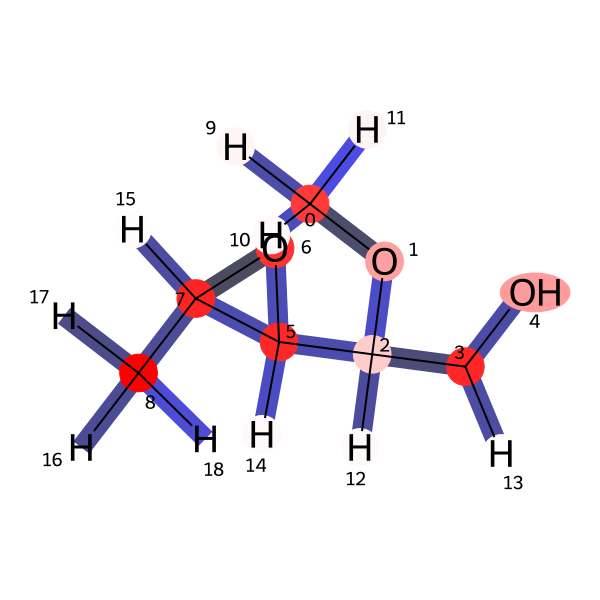

This updated `README.md` is structured for a professional research portfolio. It incorporates your specific figures and uses a clean, academic tone without emojis.

***

# Interpretable Graph Neural Networks for Molecular Dipole Prediction

This repository implements a Geometric Deep Learning framework for the prediction of molecular dipole moments ($\mu$) using the QM9 dataset. The core objective of this project is to bridge the gap between black-box Graph Neural Networks (GNNs) and chemical theory by utilizing post-hoc explainability techniques.

## Project Overview
Predicting molecular properties is a cornerstone of computational chemistry. This project utilizes a Message-Passing Graph Neural Network to regress dipole moments and employs GNNExplainer to visualize the model's decision-making process. By mapping attribution scores back to molecular geometry, we validate that the model learns physically meaningful descriptors rather than statistical noise.

### Technical Specifications
- **Architecture**: Deep Graph Convolutional Network (GCN) with Global Additive Pooling.
- **Dataset**: QM9 (Quantum Chemistry Dataset).
- **Explainability**: GNNExplainer for node and edge feature attribution.
- **Visualization**: Dual-engine rendering using NetworkX for topological awareness and RDKit for high-fidelity chemical saliency maps.

## Explainability and Chemical Intuition
The model's structural inductive bias is validated through attribution analysis. The generated heatmaps allow for a direct comparison between model focus and established chemical principles such as electronegativity and the inductive effect.

### Atomic and Structural Representation
The model treats atoms as nodes and covalent bonds as edges, utilizing Euclidean coordinates to maintain geometric awareness.


### Global Feature Sensitivity
Sensitivity analysis shows that the model prioritizes atomic numbers and specific heteroatom species (O, N) over structural descriptors like degree or valence. This aligns with the physical reality that dipole moments are primarily driven by charge distribution across electronegative centers.


### Saliency Mapping
Using RDKit, we generate chemical-aware saliency maps. These visualizations confirm that the GNN focuses on polar bonds and heteroatom interfaces while correctly "denoising" terminal hydrogen atoms.



## Installation and Usage

### Prerequisites
- Python 3.10+
- PyTorch and PyTorch Geometric
- RDKit
- NetworkX
- Matplotlib and Seaborn

### Setup
```bash
pip install torch-geometric rdkit matplotlib networkx seaborn
```

### Running the Analysis
The provided notebooks include the full pipeline for training, explanation generation, and visualization. To generate a saliency map for a specific molecule:

```python
# Aggregate feature importance and render via RDKit
atom_imp = explanation.node_mask.sum(dim=1)
# (See notebooks/Graph-Neural-Networks-for-Molecular-Property-Prediction-and-Explainability AI.ipynb for full implementation)
```

## Results
The implementation demonstrates that the GNN focuses on the molecular core and functional groups (C-O, C-N) when predicting dipole moments. The negligible attribution assigned to hydrogen atoms proves the model's robustness and its ability to distinguish between structural bulk and electronic "hotspots."


## Conclusion
This work illustrates that GNNs can achieve high predictive accuracy while remaining physically interpretable. By integrating explainability into the workflow, we transform the neural network into a transparent tool for molecular analysis, providing a framework for the discovery of property-specific chemical motifs.

---
**Author**: Abrhaley Hailenchael  
**GitHub**: [abrhaleyarefaine1997](https://github.com/abrhaleyarefaine1997)  
**Project**: Computational Chemistry and Geometric Deep Learning